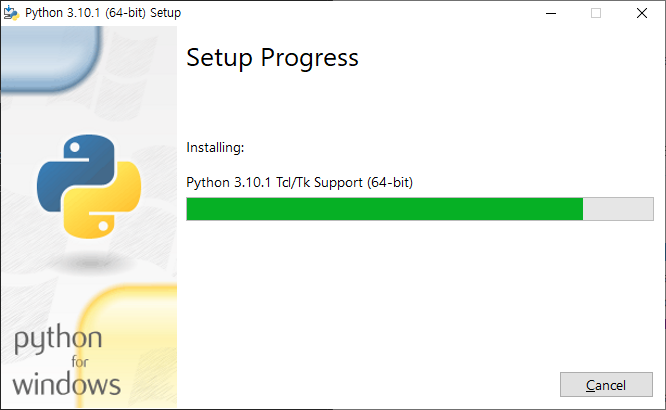
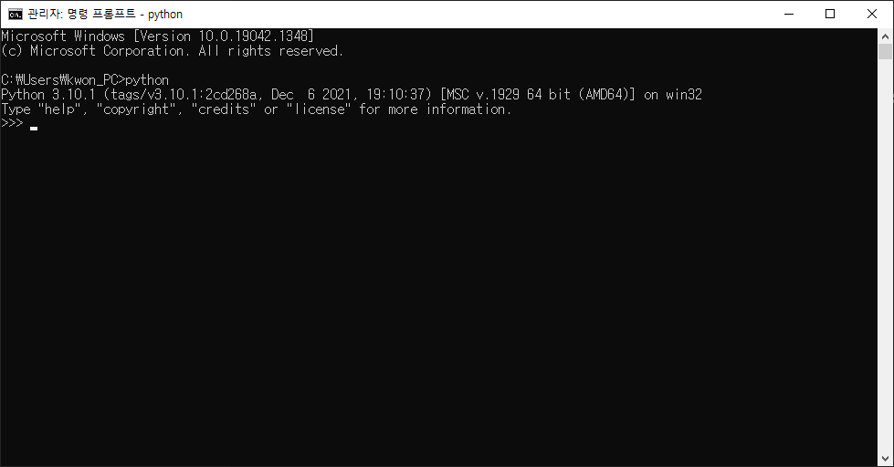
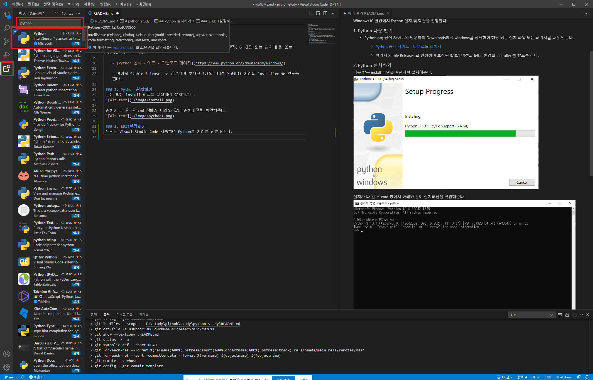
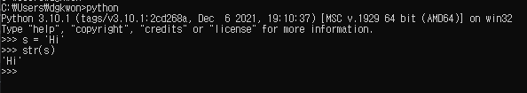
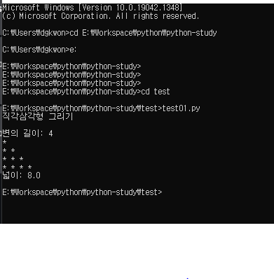

python-study
===
이곳은 Python을 학습하는 곳입니다.

---

## Python이란?
파이썬은 1991년 프로그래머인 귀도 반로섬이 발표한 고급 프로그래밍 언어로, 플랫폼에 독립적이며<br>
인터프리터식, 객체지향적, 동적타이핑 대화형 언어이다.<br>
파이썬이라는 이름은 귀도가 좋아하는 코미디〈Monty Python's Flying Circus〉에서 따온 것이다.

---

## Python 설치 및 EDIT 설정
Windows10 환경에서 Python 설치 및 학습을 진행한다.

### 1. Python 다운 받기
- Python.org 공식 사이트의 방문하여 Downloads에서 windows를 선택하여 해당 되는 설치 파일 또는 패키지를 다운 받는다.
    
    - [Python 공식 사이트 - 다운로드 페이지](https://www.python.org/downloads/windows/)
    
    - 여기서 Stable Releases 로 안정성이 보장된 3.10.1 버전과 64bit 환경의 instraller 를 받도록 한다.
 
 ### 2. Python 설치하기
 - 다운 받은 install 파일을 실행하여 설치해준다. 
 

 - 설치가 다 된 후 cmd 창에서 아래와 같이 설치버전을 확인해준다.  
 

 ### 3.EDIT설정하기
 우리는 Visual Studio Code 사용하여 Python을 환경을 만들어준다.
  - 확장 프로그램에서 Python검색하여 설치를 해준다.
  

---

## Python shell "Hi" 찍기
### cmd 창에서 python 진입 후 Hi를 입력한다.


## Python py 만들어서 실행해 보기
### test01 이라는 폴더를 생성 후 그안에 test01.py를 만들었다. 
``` python
print('직각삼각형 그리기\n')
leg = int(input('변의 길이: '))

for i in range(leg):
    print('* ' * (i + 1))

area = (leg ** 2) / 2
print('넓이:', area)
```
위 와 같이 입력 후 IDE tool에서 실행하거나, cmd를 통해 실행결과를 확인한다.


정상적으로 잘 나온 것을 확인할 수 있다.

이제부터 tutorial을 통해서 파이썬의 기본 문법에 대해서 알아보자.